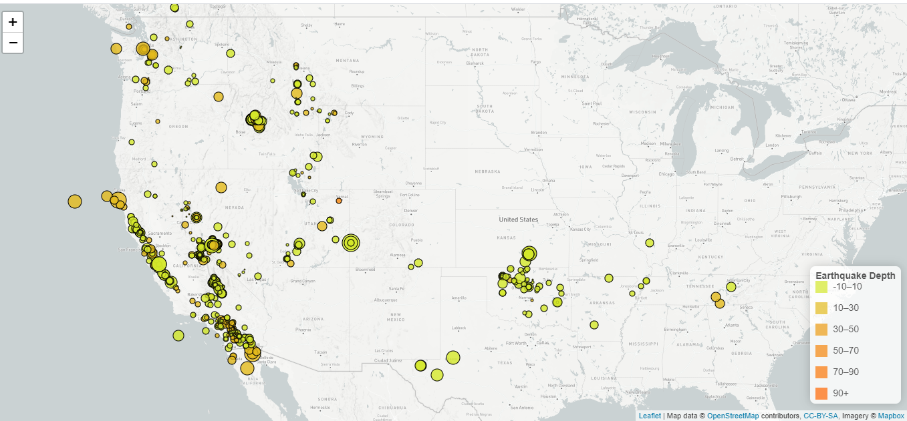
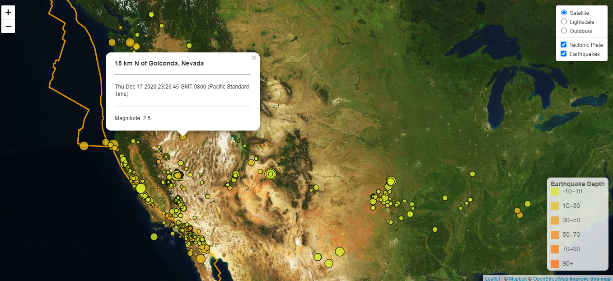

# leaflet-challenge

[Link to Map](https://lensin3.github.io/leaflet-challenge/)

## **Visualizing Earthquake Data**

This project visualizes weekly earthquake data from USGS, agency responsible for providing scientific data about natural hazards, the health of our ecosystems and environment; and the impacts of climate and land-use change.

## **Tasks**

The project consists of two sets of visualizations:

### **Leaflet-Step-1**

This task involves the development of a single layer map highlighting earthquake magnitude by marker (circle) size and depth of tremor by color intensity of the markers.

The map also displays a legend representing the depth of the tremors as seen above.

### **Leaflet-Step-2**

This task involves developing a three base-layer map of both earthquake data and that of continental tectonic plates.

The interactive map contains orange polygons as markers together with all the features of the previous map.

## **Tools and Libraries**

- leaflet.js
- d3.js
-JavaScript
- HTML
- CSS

## **Data**

- [USGS GeoJSON Feed](http://earthquake.usgs.gov/earthquakes/feed/v1.0/geojson.php)

- [Tectonic-Plates-Data](<https://github.com/fraxen/tectonicplates>)

